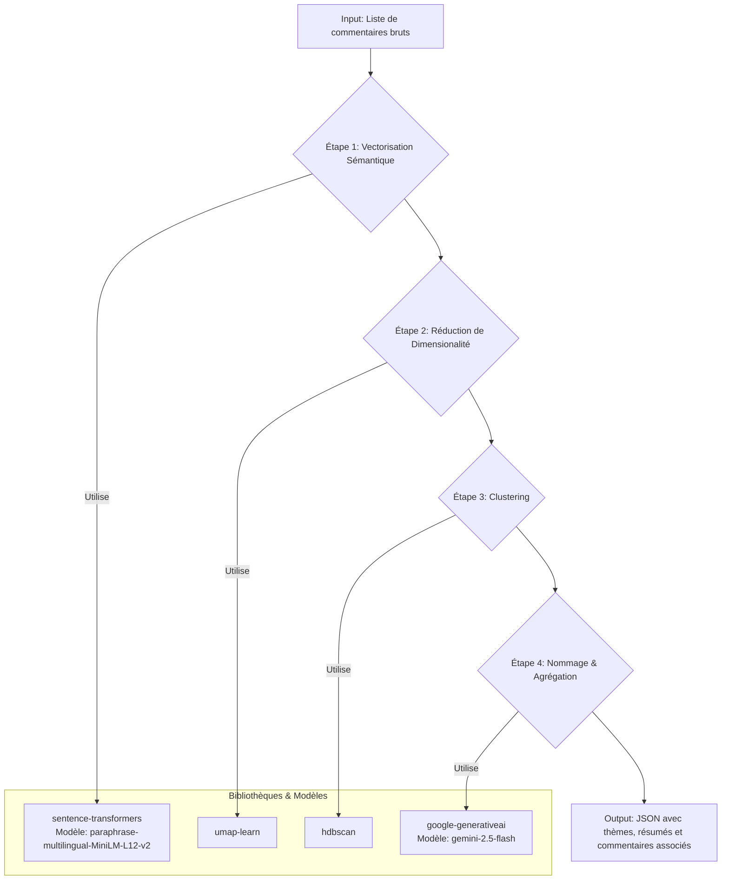

# Plan Technique : Nouvelle Architecture d'Analyse Thématique

## 1. Objectif

Remplacer l'actuelle méthode d'analyse thématique basée sur LDA (Latent Dirichlet Allocation) dans la fonction `analyze_batch_route` par une pipeline moderne basée sur l'analyse sémantique. La nouvelle architecture doit être capable de :
1.  Comprendre le sens des commentaires grâce aux embeddings.
2.  Regrouper les commentaires en thèmes sémantiques cohérents.
3.  Fournir un nom et un résumé intelligibles pour chaque thème.
4.  Retourner la liste complète des commentaires associés à chaque thème pour une exploration interactive.

## 2. Architecture et Flux de Traitement

La pipeline se déroulera en quatre étapes principales, orchestrées au sein de la route Flask.



## 3. Bibliothèques Requises

Les bibliothèques suivantes devront être ajoutées au fichier `requirements.txt` :

```
# Pour l'analyse sémantique
sentence-transformers
umap-learn
hdbscan
```

Les bibliothèques `scikit-learn`, `google-generativeai` et `Flask` sont déjà présentes et seront réutilisées.

## 4. Flux de Traitement Détaillé

1.  **Réception des Données** : La fonction `analyze_batch_route` reçoit une liste d'objets `comment`.

2.  **Étape 1 : Vectorisation (Embedding)**
    *   Initialiser le modèle `SentenceTransformer('paraphrase-multilingual-MiniLM-L12-v2')`.
    *   Extraire le texte de chaque commentaire (`comment['text']`).
    *   Utiliser `model.encode()` sur la liste des textes pour obtenir une matrice d'embeddings. Chaque ligne est un vecteur représentant un commentaire.

3.  **Étape 2 : Réduction de Dimensionalité (UMAP)**
    *   Initialiser `UMAP(n_neighbors=15, n_components=20, min_dist=0.0, metric='cosine')`.
    *   Appliquer `umap_model.fit_transform()` sur la matrice d'embeddings pour obtenir des vecteurs de plus faible dimension.

4.  **Étape 3 : Clustering (HDBSCAN)**
    *   Initialiser `HDBSCAN(min_cluster_size=5, metric='euclidean', cluster_selection_method='eom')`.
    *   Appliquer `hdbscan_model.fit()` sur les vecteurs réduits par UMAP.
    *   Le résultat (`hdbscan_model.labels_`) est un tableau où chaque élément est l'ID du cluster (thème) pour le commentaire correspondant. Une valeur de `-1` indique un commentaire "bruit" (hors-thème).

5.  **Étape 4 : Nommage des Thèmes et Agrégation des Données**
    *   Créer un dictionnaire pour regrouper les commentaires par ID de cluster.
    *   Pour chaque cluster (ID de `0` à `n`) :
        *   Prendre un échantillon de 5 à 10 commentaires du cluster.
        *   Concaténer ces commentaires en un seul texte.
        *   Envoyer ce texte à l'API Gemini avec un prompt structuré :
            > "En te basant sur les commentaires suivants, fournis un titre court (3-5 mots) et un résumé concis (1 phrase) pour le thème principal. Réponds uniquement au format JSON suivant : {\"theme_name\": \"...\", \"theme_summary\": \"...\"}"
        *   Parser la réponse JSON de Gemini pour obtenir le nom et le résumé du thème.
    *   Construire l'objet de réponse final.

## 5. Structure de Données en Sortie (JSON)

L'API `/api/analyze_batch` retournera un objet JSON avec la structure suivante. Ceci est conçu pour permettre au front-end de construire facilement une interface interactive où l'utilisateur peut cliquer sur un thème pour voir tous les commentaires associés.

```json
{
  "summary": {
    "processedCount": 150,
    "themeCount": 4,
    "noiseCount": 12 
  },
  "themes": [
    {
      "themeId": 0,
      "name": "Problèmes de Son",
      "summary": "Plusieurs utilisateurs signalent que la qualité audio est médiocre ou désynchronisée à certains moments de la vidéo.",
      "commentCount": 25,
      "comments": [
        {
          "id": "comment_id_1",
          "text": "Le son est vraiment mauvais à partir de 5:30, on n'entend plus rien.",
          "author": "User123",
          "likeCount": 42,
          "sentiment": "négatif",
          "confidence": 0.98
        },
        {
          "id": "comment_id_2",
          "text": "Super vidéo mais le son grésille beaucoup, dommage.",
          "author": "User456",
          "likeCount": 15,
          "sentiment": "neutre",
          "confidence": 0.85
        }
      ]
    },
    {
      "themeId": 1,
      "name": "Suggestions de Sujets",
      "summary": "Les spectateurs proposent des idées pour de futures vidéos, notamment sur l'intelligence artificielle et le machine learning.",
      "commentCount": 18,
      "comments": [
      ]
    }
  ],
  "unclassifiedComments": [
    {
      "id": "comment_id_99",
      "text": "premiers!",
      "author": "User789",
      "likeCount": 0,
      "sentiment": "neutre",
      "confidence": 0.99
    }
  ]
}
```

## 6. Justification des Choix Technologiques

*   **`sentence-transformers`** : Standard de l'industrie pour des embeddings sémantiques de haute qualité. Le modèle multilingue est un avantage clé.
*   **`UMAP` + `HDBSCAN`** : Ce duo est extrêmement puissant pour le clustering exploratoire. Il ne nécessite pas de définir un nombre de clusters a priori et gère élégamment le bruit, ce qui est essentiel pour des données textuelles non structurées comme les commentaires.
*   **`google-generativeai`** : L'utilisation d'un LLM pour le nommage des thèmes permet d'obtenir des titres et résumés qualitatifs et directement compréhensibles, ce qui est impossible avec des approches purement statistiques comme LDA.

Ce plan fournit une feuille de route claire pour l'implémentation de la nouvelle fonctionnalité.
